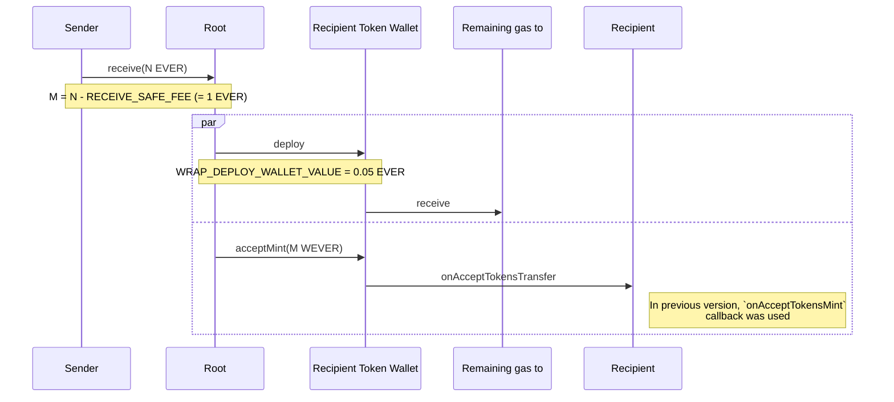
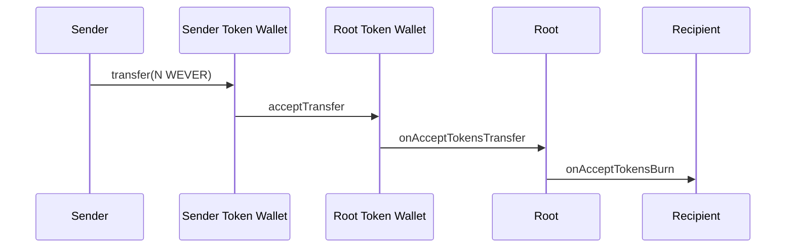
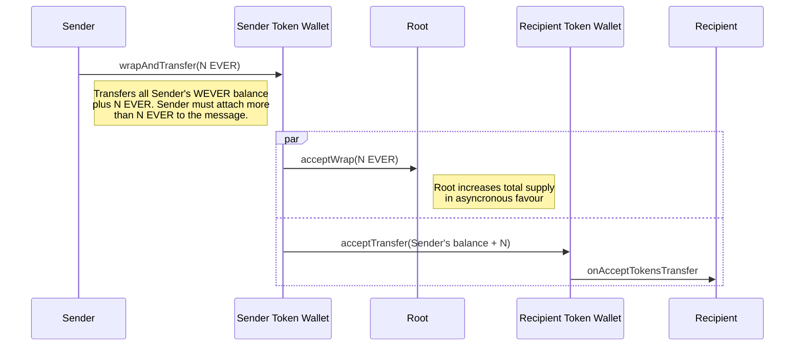
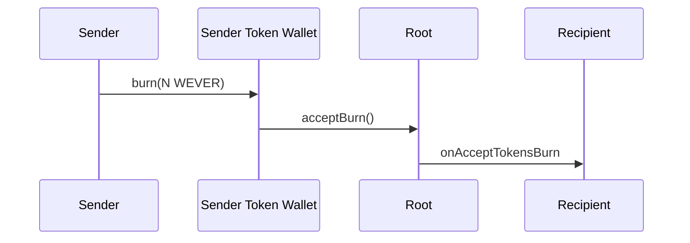

  

# Wrapped EVER

The Wrapped EVER project allows you to use the [Everscale](https://everscale.network/) native EVER token in a form of [TIP3](https://github.com/everscale-org/docs/blob/main/src/Standard/TIP-3/1.md) compatible token.

Wrapped EVER works pretty much the same as Wrapped Ether. Minting and burning happens on the Everscale network. Anyone can mint wEVERs by locking EVERs in the `Vault` contract. Also, wEVERs can be burned in order to receive EVERs.

# Architecture

1. Vault functionality implemented in the Root contract

## Mint WEVERs by sending EVERs to the Root

## Release EVERs by transferring WEVERs to the Root

## Transfer more WEVERs by silently minting them

## Burn WEVERs

